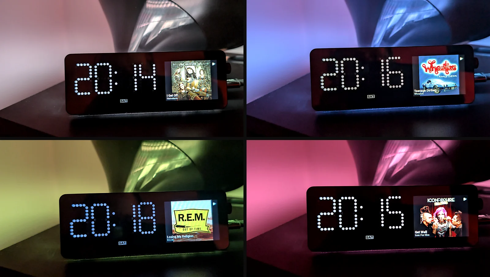
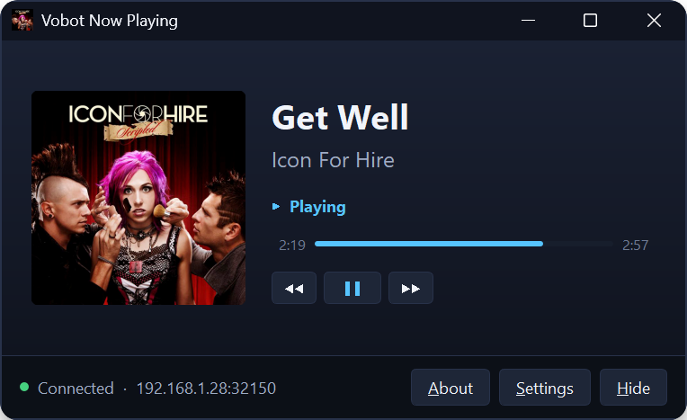

# Vobot Now Playing

Send what Windows is playing (title, artist, album, cover art and playback state) to a
[Vobot Mini Dock](https://dock.myvobot.com/) sitting on your desk.

<p align="center">
  
</p>

Windows already knows what every media player on your machine is doing. This puts that on a
little screen you can actually see, instead of buried behind whichever window is on top.

## How it works

Two halves that talk over your local network:

- **Windows client** (PyQt5) watches the Windows media session, converts the cover art, and
  pushes it to the dock over TCP.
- **Mini Dock app** (MicroPython + LVGL) listens on the dock, and draws what arrives.

The client sits in the notification area and keeps feeding the dock while its window is closed.

<p align="center">
  
</p>

## Features

- Live title, artist, album and play/pause/stopped state from any player Windows knows about:
  Spotify, foobar2000, browsers, whatever registers a media session.
- Album art at 320×240, converted to RGB565 for the dock's panel.
- **Transport controls.** Previous, play/pause and next, driven from the client window. Each
  button is enabled only when the current source says it accepts that command.
- **Ambient light.** The dock's LED strip can be lit with the dominant colour of the current cover
  art. Off by default, and enabled with a brightness setting of its own. The colour is picked
  rather than averaged, since an average comes out grey-brown for any cover with more than one hue
  in it, and a cover with no colour in it shows white instead of being forced to a hue.
- **Playback position** in the client window, for sources that report one. Windows publishes the
  position as an occasional timestamped snapshot rather than a running clock, so the bar is
  extrapolated from it between updates, staying accurate to under a second across a minute of drift.
- **Taskbar integration**, in four parts you can opt into separately: a play/pause badge on the
  taskbar button, transport buttons on the thumbnail toolbar, cover art as the window icon, and
  playback position on the taskbar progress bar.
- **Automatic discovery.** The client finds the dock over UDP broadcast, so there is no IP
  address to look up on first run.
- **Artwork is only sent once.** The client announces an artwork ID and the dock says whether it
  already has it, so a play/pause does not re-send 150KB of pixels.
- Runs in the notification area, with optional start-hidden and close-to-tray behaviour.

See [CHANGELOG.md](CHANGELOG.md) for what has changed between releases.

## Requirements

| | |
|---|---|
| Windows | 10 (version 1809 or later) or Windows 11 |
| Dock | Vobot Mini Dock, firmware 1.1.0 or later |
| Network | Both on the same LAN |
| Python | 3.13, only if running from source |

## Installation

### Windows client

Download the latest `.zip` from [Releases](https://github.com/se0siris/vobot-now-playing/releases),
unpack it anywhere, and run `Vobot Now Playing.exe`. There is no installer.

The zip also contains the matching Mini Dock app, so both halves come from one download.

### Mini Dock app

Copy the `win_now_playing/` folder to the `apps/` folder on the dock, using
[Thonny](https://thonny.org/) or the dock's own app manager. Restart the dock and open
**Windows Now Playing** from the app menu.

It is in the release zip alongside the client, or under `esp32/apps/` if you are working from
a clone.

The app listens on TCP port **32150** by default. If you need a different port, set `port` in the
app's settings on the dock's web interface.

The two halves are versioned separately, and a mismatch is not fatal: either end works with an
older counterpart, minus whatever that release added. The ambient light needs the client at 1.1.0
and the dock app at 2.1.0.

## Configuration

On first run the client searches the network and configures itself. If you would rather set the
address by hand, or the search finds more than one dock, use **Settings**:

- **Address / Port.** Where the dock is. **Discover** searches for it, and **Test Connection**
  checks it without disturbing whatever the dock is currently showing.
- **Find the dock automatically.** Re-searches when a push fails, so a new DHCP lease doesn't
  need your attention.
- **Ambient light.** Match the dock's light to the album art, with a brightness setting.
  Off by default: turning it on makes the dock's app take ownership of the light, which suppresses
  whatever the device was otherwise doing with it.
- **Taskbar.** Keep a taskbar button while hidden, use the button as a media control, show the
  album art as the taskbar icon, and show track progress on the button. All off by default, so out
  of the box the app keeps an ordinary taskbar button.
- **Window.** Keep running in the notification area when closed, start hidden, and explain where
  the window went when it hides. That last one can also be turned off by clicking the notification
  itself.

Settings live in a plain INI file you can edit directly:

```
%APPDATA%\overThere\Vobot Now Playing\settings.ini
```

Changes made by hand apply on the next launch.

## The protocol

One TCP connection per update. The client sends a single line of JSON, the dock replies with a
JSON acknowledgement, and the artwork body only follows if the dock asks for it:

```
client → {"title": ..., "artist": ..., "status": "PLAYING", "art_id": "…", "image_len": 153600, "light": [220, 90, 40, 60], "proto": 4}
dock   → {"ok": true, "send_art": true, "w": 320, "h": 240}
client → <153,600 bytes of RGB565>
dock   → {"ok": true}
```

`send_art` is false when the dock already holds that `art_id`, which is what keeps a pause event
cheap. The dock reports its own panel geometry in `w`/`h`, so the client sizes future frames to
whatever hardware answered rather than assuming 320×240.

`light` is three-state, and the distinction matters because all three happen routinely. Absent
means leave the light exactly as it is, `null` means release it back to the device, and
`[r, g, b, brightness]` means take ownership and show that colour. Since an absent field is what a
pre-4 client sends for everything, updating the dock app on its own never disturbs the light.

Discovery is a UDP broadcast on port **32151**, deliberately fixed rather than following the
configured TCP port, since a client that already knew the port would have nothing to discover. The
dock replies with its address, the TCP port it actually bound, and its device ID.

## Building from source

Uses [uv](https://docs.astral.sh/uv/) for dependencies.

```bash
uv sync                                 # install dependencies
uv run python vobot_now_playing.py      # run the client
uv run pyinstaller pyinstaller.spec     # build dist/Vobot Now Playing/
```

Linting and formatting use [ruff](https://docs.astral.sh/ruff/):

```bash
uv run ruff check                       # lint
uv run ruff format                      # format
```

Regenerating UI code after editing a form in Qt Designer:

```bash
uv run python -m PyQt5.uic.pyuic ui/mainwindow.ui -o ui/Ui_mainwindow.py
uv run python -m PyQt5.uic.pyuic ui/settings_dialog.ui -o ui/Ui_settings_dialog.py
uv run python -m PyQt5.uic.pyuic ui/about_dialog.ui -o ui/Ui_about_dialog.py
```

Releases are built by GitHub Actions. Pushing a `vX.Y.Z` tag builds the client and opens a draft
release; the tag must match `VERSION_NUMBER` in `constants.py` or the build stops before it starts.

## Project layout

```
vobot_now_playing.py            Entry point
device_link.py                  Wire protocol
discovery.py                    UDP discovery
media_image.py                  Artwork selection, RGB565 packing, colour extraction
settings.py                     Persisted settings
ui/                             Windows client UI
ui/taskbar.py                   Taskbar button, badge, thumbnail toolbar
esp32/apps/win_now_playing/     The Mini Dock app
```

## Licence

The **Windows client is GPL v3**, as set out in [LICENSE](LICENSE). This follows from PyQt5, which
is itself GPL v3, so anything distributed with it must be too.

The **Mini Dock app** under `esp32/` is **MIT**, matching the convention of the other apps in the
Vobot ecosystem so it can be freely borrowed from. It is a separate program that links none of the
client's dependencies.

## Author

Gary Hughes, [github.com/se0siris](https://github.com/se0siris)

Not affiliated with Vobot. Bug reports and pull requests are welcome on the
[issue tracker](https://github.com/se0siris/vobot-now-playing/issues).
